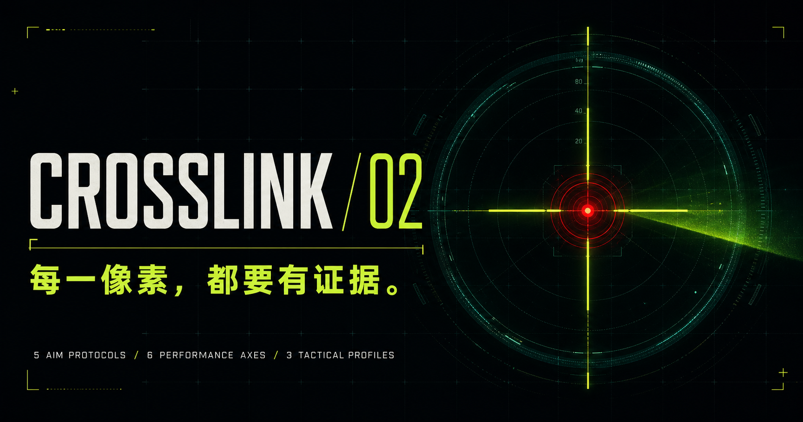
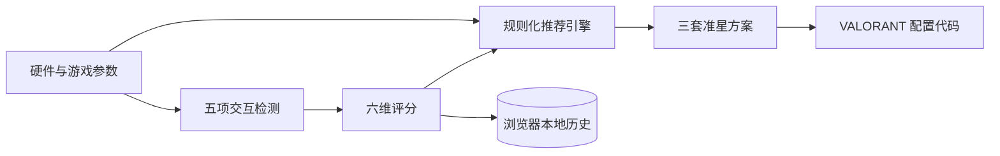

<div align="center">

# Crosshair Lab 2.0

通过五项交互式瞄准检测，生成有依据、可复测、可直接导入 VALORANT 的个性化准星方案。

[](https://personal-crosshair-lab.team-3099.chatgpt.site)
[](https://www.typescriptlang.org/)
[](https://react.dev/)
[](https://nextjs.org/)
[](https://nodejs.org/)
[](LICENSE)

[在线体验](https://personal-crosshair-lab.team-3099.chatgpt.site) · [本地运行](#快速开始) · [桌面版本](#桌面版本) · [工作原理](#工作原理)

</div>



## 项目简介

Crosshair Lab 不直接复制职业选手参数，而是结合玩家的硬件设置、操作表现和视觉偏好建立六维瞄准画像，再生成三套可调整的准星建议与 VALORANT 导入代码。

所有检测和推荐逻辑都在浏览器本地执行；测试记录只保存在当前设备的 `localStorage` 中，不会上传瞄准数据。

## 功能亮点

| 能力 | 说明 |
| --- | --- |
| 作战参数校准 | 记录 DPI、游戏灵敏度、分辨率、主武器、交战距离和操作风格 |
| 五项检测 | 神经反应、目标获取、微操控制、战场辨识、动态追踪 |
| 六维能力画像 | 反应、甩枪、微操、追踪、辨识和稳定性评分 |
| 个性化推荐 | 综合 eDPI、武器类型、距离与检测结果生成三套方案 |
| 实时预览 | 切换方案、造型和 HEX 颜色时即时预览准星 |
| 游戏内导入 | 一键复制 VALORANT 准星配置代码 |
| 本地历史 | 最多保存 12 次检测，展示复测变化并支持随时清除 |
| 多端运行 | 支持 Web 页面和 Windows Electron 便携版构建 |

## 工作原理



推荐逻辑由可审查的 TypeScript 规则实现：检测结果先归一化为六项能力分数，再结合 eDPI、武器类别、交战距离和视觉辨识结果调整准星间隙、线长、颜色与造型。它是辅助配置工具，不是竞技水平诊断或胜率预测系统。

## 快速开始

### 环境要求

- Node.js 22.13+
- npm 10+

### 启动开发服务器

```bash
git clone https://github.com/saber080420-create/valorant-crosshair-lab.git
cd valorant-crosshair-lab
npm ci
npm run dev
```

按照终端输出访问本地地址，通常为 <http://localhost:3000>。

### 生产构建

```bash
npm run build
npm run start
```

## 桌面版本

预览 Electron 页面：

```bash
npm run desktop:preview
```

构建 Windows 便携版：

```bash
npm run desktop:build
```

构建产物输出到 `outputs/desktop/`。桌面构建需要 Windows 环境以及 Electron Builder 所需的系统能力。

## 质量检查

```bash
# 代码规范
npm run lint

# 先执行生产构建，再验证服务端渲染结果和关键页面契约
npm test
```

HTML 契约测试会检查页面标题、核心检测模块、本地历史清理能力以及关键交互文案，防止构建产物遗漏主要功能。

## 技术栈

| 分类 | 技术 |
| --- | --- |
| Web | React 19、Next.js 16、TypeScript 5、Tailwind CSS 4 |
| Build | vinext、Vite 8、Cloudflare Vite Plugin |
| Desktop | Electron 43、Electron Builder |
| Test | Node.js Test Runner、ESLint 9 |
| Storage | Browser `localStorage` |

## 项目结构

```text
.
├── app/
│   ├── page.tsx              # 检测流程、评分、推荐与代码生成
│   ├── globals.css           # 视觉系统和响应式布局
│   └── layout.tsx            # SEO 与社交分享元数据
├── desktop/                  # Electron 主进程、预加载和渲染入口
├── public/                   # 图标与社交分享图片
├── tests/                    # 构建产物契约测试
├── worker/                   # Cloudflare Worker 入口
└── vite.desktop.config.ts    # 桌面端构建配置
```

## 数据与隐私

- 检测、评分和配置生成均在客户端完成。
- 历史记录保存在浏览器本地，默认不上传到远程服务。
- 页面提供“清除测试记录”操作，可删除当前设备上的历史数据。
- 清除浏览器站点数据或更换设备后，本地记录不会自动恢复。

## 游戏内导入

复制生成的准星代码后，在 VALORANT 中依次打开：

```text
设置 → 准星 → 导入准星配置代码
```

准星配置编码并非 Riot Games 承诺永久稳定的公开 API。若游戏更新改变编码格式，本项目也需要相应调整。

## 贡献

欢迎通过 Issue 报告兼容性问题或提出改进建议。提交 Pull Request 前，请先运行：

```bash
npm run lint
npm test
```

## 免责声明

本项目是独立的社区玩家工具，与 Riot Games 不存在隶属、合作或背书关系。VALORANT 及相关商标归 Riot Games 所有。

## 许可证

本项目采用 [MIT License](LICENSE)。
